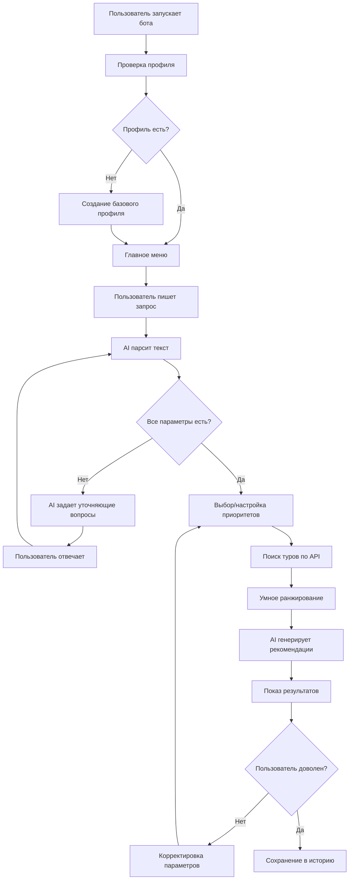

# Переработка архитектуры AI Travel Agent

## Проблемы текущей реализации

1. **Профиль смешивает постоянные данные и параметры поездки**
   - Имя, город проживания - это постоянные данные
   - Даты, бюджет, страна - это параметры конкретной поездки

2. **Отсутствует полноценный AI парсинг**
   - Пользователь должен писать естественным языком
   - AI должен извлекать параметры и задавать уточняющие вопросы

3. **Нет системы приоритетов и весов**
   - Это ключевая фишка приложения
   - Должны быть разные профили приоритетов для разных типов отдыха

4. **Примитивная выдача результатов**
   - Нет умного ранжирования
   - Не учитываются веса и предпочтения
   - Показываются неподходящие по бюджету туры

5. **Слабая групповая логика**
   - Не учитываются компромиссы между участниками
   - Нет визуализации пересечений интересов

## Новая архитектура

### 1. Разделение данных

#### Профиль пользователя (постоянный)
```typescript
interface UserProfile {
  userId: string; // Telegram ID
  name: string;
  departureCity: string; // Город вылета по умолчанию
  preferredCountries?: string[]; // Любимые страны
  travelStyle?: 'budget' | 'comfort' | 'luxury'; // Стиль путешествий
  defaultPriorities?: TravelPriorities; // Дефолтные приоритеты
  language?: string;
  createdAt: Date;
  updatedAt: Date;
}
```

#### Поисковый запрос (временный)
```typescript
interface SearchRequest {
  id: string;
  userId: string;
  rawText: string; // Исходный текст пользователя
  parsedParams: {
    destination?: string[];
    dateType: 'fixed' | 'flexible' | 'anytime';
    startDate?: Date;
    endDate?: Date;
    flexibleMonth?: string;
    duration?: number;
    budget?: number;
    budgetType?: 'total' | 'perPerson';
    adults: number;
    children: number;
    childrenAges?: number[];
  };
  priorities: TravelPriorities; // Веса для этого поиска
  aiContext?: any; // Контекст AI для follow-up вопросов
  status: 'draft' | 'ready' | 'searching' | 'completed';
  createdAt: Date;
}
```

#### Приоритеты и веса
```typescript
interface TravelPriorities {
  profileName?: string; // "Пляжный отдых", "Активный отдых", etc
  weights: {
    price: number;        // 0-10 - Важность цены
    starRating: number;   // 0-10 - Важность звездности
    beachLine: number;    // 0-10 - Важность линии пляжа
    mealType: number;     // 0-10 - Важность питания
    location: number;     // 0-10 - Важность расположения
    reviews: number;      // 0-10 - Важность отзывов
    familyFriendly: number; // 0-10 - Для семей с детьми
    activities: number;   // 0-10 - Важность развлечений
    quietness: number;    // 0-10 - Важность тишины
  };
}
```

### 2. AI-driven взаимодействие

#### Парсинг текста через AI
```typescript
// Пользователь пишет:
"Хочу в Турцию в августе на недельку, бюджет 150к на двоих, 
с ребенком 5 лет, важно чтобы было все включено и анимация"

// AI парсит в:
{
  destination: ["Турция"],
  flexibleMonth: "август",
  duration: 7,
  budget: 150000,
  budgetType: "total",
  adults: 2,
  children: 1,
  childrenAges: [5],
  requirements: ["all_inclusive", "animation"],
  priorities: {
    mealType: 10,
    familyFriendly: 9,
    activities: 8
  }
}
```

#### Уточняющие вопросы от AI
```typescript
// AI анализирует и понимает что не хватает:
{
  missingRequired: ["departureCity"],
  missingOptional: ["beachPreference", "hotelStars"],
  clarifications: [
    "Из какого города вылет?",
    "Какая минимальная звездность отеля устроит?",
    "Песчаный или галечный пляж предпочитаете?"
  ]
}
```

### 3. Умное ранжирование туров

#### Расчет соответствия
```typescript
function calculateTourScore(tour: Tour, request: SearchRequest): number {
  const weights = request.priorities.weights;
  let scores = {
    price: calculatePriceScore(tour.price, request.budget),
    stars: tour.hotelStars / 5,
    beach: calculateBeachScore(tour),
    meal: calculateMealScore(tour.mealType, request),
    location: calculateLocationScore(tour),
    reviews: tour.rating / 5,
    family: calculateFamilyScore(tour, request),
    activities: calculateActivitiesScore(tour),
    quietness: calculateQuietnessScore(tour)
  };
  
  // Взвешенная сумма
  let totalWeight = 0;
  let totalScore = 0;
  
  for (const [key, weight] of Object.entries(weights)) {
    totalWeight += weight;
    totalScore += scores[key] * weight;
  }
  
  return (totalScore / totalWeight) * 100;
}

// Фильтрация по бюджету
function filterByBudget(tours: Tour[], budget: number): Tour[] {
  return tours.filter(tour => {
    // Не показываем туры дешевле 40% от бюджета
    const minPrice = budget * 0.4;
    // И дороже бюджета
    return tour.price >= minPrice && tour.price <= budget;
  });
}
```

#### AI-powered рекомендации
```typescript
// AI анализирует результаты и дает рекомендации
async function generateRecommendations(
  tours: Tour[], 
  request: SearchRequest
): Promise<string[]> {
  return [
    "🌟 Лучшее соотношение цена/качество: Rixos Premium Belek",
    "👨‍👩‍👧 Идеально для семьи: Delphin Imperial с отличной анимацией",
    "💰 Бюджетный вариант с высоким рейтингом: Crystal Waterworld",
    "🏖️ Лучший пляж: Maxx Royal Belek Golf Resort"
  ];
}
```

### 4. Сценарий взаимодействия



### 5. Групповой поиск

```typescript
interface GroupSearch {
  id: string;
  participantIds: string[];
  individualRequests: SearchRequest[];
  mergedParams: {
    destination: string[]; // Пересечение
    dateRange: DateRange; // Общий период
    totalBudget: number;
    composition: TravelerComposition;
  };
  compromises: {
    [userId: string]: {
      parameter: string;
      originalValue: any;
      compromisedValue: any;
      importance: number;
    }[];
  };
  groupPriorities: TravelPriorities; // Усредненные веса
}
```

### 6. История и обучение

```typescript
interface SearchHistory {
  userId: string;
  searches: SearchRequest[];
  bookings: Booking[];
  preferences: {
    favoriteDestinations: string[];
    averageBudget: number;
    preferredDuration: number;
    typicalComposition: TravelerComposition;
  };
}

// AI учится на истории
async function learnUserPreferences(history: SearchHistory): Promise<UserInsights> {
  // Анализ паттернов
  // Предсказание предпочтений
  // Персонализация рекомендаций
}
```

## План внедрения

1. **Этап 1: Базовая переработка (1-2 недели)**
   - Разделить профиль и поисковые запросы
   - Создать таблицу search_requests
   - Переработать flow в боте

2. **Этап 2: AI интеграция (2-3 недели)**
   - Настроить OpenRouter для парсинга
   - Реализовать уточняющие вопросы
   - Добавить AI рекомендации

3. **Этап 3: Система приоритетов (1 неделя)**
   - UI для настройки весов
   - Предустановленные профили
   - Алгоритм ранжирования

4. **Этап 4: Улучшение UX (1-2 недели)**
   - История поисков
   - Избранное
   - Уведомления о снижении цен

5. **Этап 5: Групповой функционал (2 недели)**
   - Алгоритм поиска компромиссов
   - Визуализация пересечений
   - Голосование за варианты

## Технические требования

### AI/ML
- OpenRouter API для NLP
- Возможно, простая ML модель для предсказания предпочтений

### База данных
- Новые таблицы: search_requests, search_history, user_insights
- Оптимизация индексов для поиска

### Кэширование
- Умное кэширование результатов поиска
- Инвалидация при изменении цен

### Мониторинг
- Отслеживание конверсии поиск → бронирование
- Анализ точности AI парсинга
- Метрики удовлетворенности